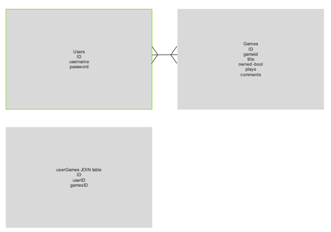

# Project 4: Board Game Index

## Project Plan
This will be a web based application to keep track of board games owned.
You will be able to log in and add board games to your collection. I found a good resource for this project at Board Game Atlas API.

## Project Links
[Here is the frontend repository.](https://github.com/nealpoppe/bgi-frontend)
[Here is the published frontend.](http://bgi.surge.sh/)

[Here is the backend repository.](https://github.com/nealpoppe/bgi-backend)
[Here is the published backend.](https://bgi-backend.herokuapp.com/)

## Entity Relationship Diagram


## Technical Goals


## Technology Used
* React
* Bootstrap
* Surge for deployment
* Sequelize
* Heroku for deployment

## Example Code
I had some issues with adding a game to my collection due to different variable names. With some help I was able to make sure the games were added the the game list and the user.
```
const addGame = (req,res) => {
  const gameData = {
    title: req.body.title,
    gameid: req.body.gameid
  }
  Game.create(gameData)
  .then(createdGame => {
    const userData = {
      userId: req.body.userId,
      gameId: createdGame.id
    }
    UserGame.create(userData)
    .then(userGameCreated => {
    })
  })
}
```
This is a small win. I was able to list the collection by alphabetical order using this code after I imported the user's game list.
```
this.myGames = props.addedGames.sort((a,b) => (a.title > b.title) ? 1 : -1);
```

## Issues and Resolutions
The biggest issues I had were on the backend trying to use authorizations. After many hours of work I was finally able to get logged in. But then whenever I changed pages I would get a ***Request failed with status code 401: Unauthorized when trying to get UserInfo***. I had to drop that after a few days of issues.

I still have issues with being able to see a game after it's added. I need to click off the collection then back on in order to see the new game. I also have issues with my delete game from collection button.

## User Stories

